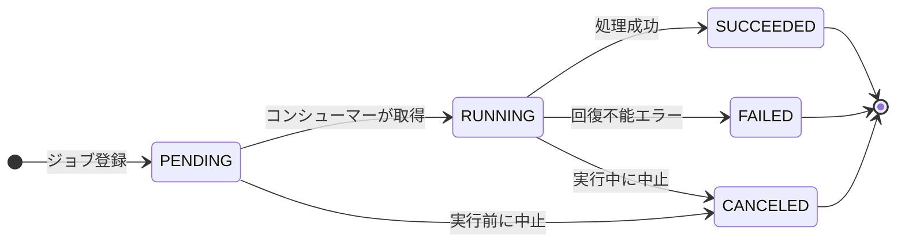

# 非同期処理のステータス管理

進捗を確認する必要がある非同期の業務ジョブには、ステータス管理テーブルを作り、DB の検索で実行状況を把握できるようにする。
区分値は PENDING、RUNNING、SUCCEEDED、FAILED、CANCELED に統一し、保留の状態を作らない。
予約実行はテーブルの開始条件をポーリングして投入し、キャンセルは実行前のステータス確認で済ませる。

用語は[メッセージングの設計](async-messaging-design.md)の定義に従う。

## 対象

利用者の要求から始まり、完了を利用者または運用者が確認する非同期処理を**業務ジョブ**と呼び、ステータス管理テーブルの対象にする。
モジュール間の通知イベントの配信状態は、Spring Modulith のイベント出版レジストリで追う。
業務コードから `modulith.event_publication` を読み書きせず、ステータス管理テーブルの代わりに使わない。

## ステータス管理テーブル

ステータス管理テーブルは、業務ジョブを所有するモジュールのスキーマに置く（[ADR-011](../adr/ADR-011-use-module-owned-database-schemas.md)）。
登録日時や開始日時などの絶対時刻は `TIMESTAMP WITH TIME ZONE` にし、[日時](../datetime/index.md)の規約に従う。

- **ジョブ ID**：業務ジョブを一意に識別するキー。トレース ID とは別に採番する。非同期が連鎖すると一つのトレースに複数のジョブが属し、トレース ID は一意にならないためである。
- **トレース情報**：ジョブとトレースを紐づける列。持たせる列は[非同期処理のトレースと監視](async-observability.md)に従う。

プロデューサーとコンシューマーは、次の順にテーブルを更新する。

1. プロデューサーは、PENDING のレコードの登録とイベントの発行を同じトランザクションで行い、呼び出し元へジョブ ID を返す。
2. コンシューマーは処理の開始時にジョブ ID のレコードを行ロックで取得し、RUNNING にする。RUNNING を別トランザクションでコミットする必要はない。
3. 処理できる状態のレコードがなければ、重複した配信として INFO または WARN のログを出して正常終了する。
4. ロックを取得できなければ、多重実行として INFO のログを出して正常終了する。
5. 成功したら、業務テーブルの更新と同じトランザクションで SUCCEEDED にする。
6. 失敗したら業務テーブルの更新はロールバックし、FAILED への更新は別のトランザクション（`REQUIRES_NEW`）でコミットする。

画面に表示する項目など、アプリケーションの要件で決まる情報はステータス管理テーブルに持たせず、別のテーブルで管理する。
表示要件の変更をステータス管理テーブルへ波及させないためである。

## ステータスの区分値と遷移

区分値は次の五つに統一する。

- **PENDING**：登録済みで、コンシューマーの取得を待っている。
- **RUNNING**：コンシューマーが処理している。
- **SUCCEEDED**：処理が成功した。
- **FAILED**：回復不能なエラーで処理が終わった。
- **CANCELED**：実行前または実行中に中止した。

- SUCCEEDED、FAILED、CANCELED は終端とし、CANCELED のジョブを再実行しない。
- SUCCEEDED を段階ごとに分けたくなった場合は、区分値を増やさず処理を分割する。
- 先行処理の待機を除き、ジョブ自体を保留や中断にする状態を作らない。実行するかどうかは、重複排除と順序制御を前提に呼び出す側で制御する。

## 予約実行

特定の時刻に始める業務ジョブは、プロデューサーがすぐにメッセージを発行せず、ステータス管理テーブルに開始条件を登録する。

- 開始時刻を条件にする場合は、`execute_at` などの列を持たせる。
- 別プロセスが定期的に条件を満たすジョブを検索し、メッセージを発行する。現在時刻は `Instant.now(clock)` で取る。
- cron 式などに限られる外部スケジューラの予約機能より、この方式を優先する。
- 開始の遅れはポーリング間隔に依存する。外部スケジューラでも数分の遅れは起こり得るため、厳密な開始時刻を要件にしない。

非同期処理の中で、開始時刻まで待機したり、処理の途中で sleep のループを回したりしない。
待機中にクラッシュすると再試行の制御が複雑になり、待機中もスレッド、メモリ、DB 接続を占有するためである。
予約を含むスケジューリングは、非同期処理を起動する側の責務にする。

## キャンセル

キャンセルを作る前に、要件が本当に必要かを確かめる。
長時間の処理を止める利点はおもに稼働費の削減であり、キャンセルの見込み件数によっては作らないほうがよい。
画面上でキャンセルとして振る舞えば足り、バックエンドの処理を止める必要がない場合もある。

キャンセルを作る場合は、次の二つの方式から選ぶ。

- **実行前のステータス確認**：キャンセル API がステータスを CANCELED にし、コンシューマーは処理開始の直前にステータスを確認して、CANCELED なら処理を飛ばす。対象は PENDING のジョブである。
- **協調的キャンセル**：RUNNING のコンシューマーが処理の途中で定期的にステータスを確認し、CANCELED なら処理を中断する。

原則として、実行前のステータス確認だけで済ませる。
協調的キャンセルは実装とテストの費用が高いため、機械学習の学習や動画のエンコードのように数時間かかる処理に限り、対象の機能を絞る。
基盤の機能でタスクを強制停止する方式も同様の作り込みを要するため、実行前のステータス確認を優先する。

## 出典

- フューチャー株式会社「非同期設計ガイドライン」（[アーキテクチャ設計ガイドライン](https://future-architect.github.io/arch-guidelines/documents/forAsync/async_guidelines.html)、commit `e309a6d`）、[CC BY 4.0](https://creativecommons.org/licenses/by/4.0/deed.ja)
- このリポジトリの規約に合わせて抜粋、再構成、改変している。取り込みの方針は [ADR-040](../adr/ADR-040-import-future-architecture-guidelines.md) に従う。
