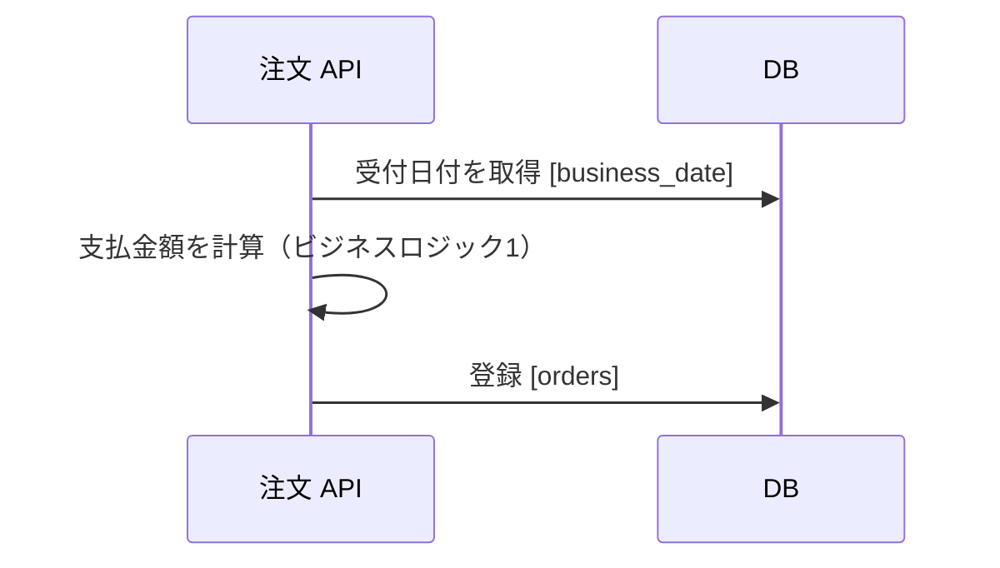

# 設計書の図

図は Mermaid で書き、Markdown のコードブロックに置く。
Mermaid で表しにくいシステム構成図だけを diagrams.net で作り、編集データを埋め込んだ `.drawio.svg` で保存する。

## Mermaid で書く図

シーケンス図、ER 図、状態遷移図、フロー図は、`mermaid` を指定したコードブロックに書く。
テキストで書くため、`git diff` で図の変更を確認できる。

- DB への矢印には、読み書きするテーブル名を角括弧で添える。
- 処理の中で計算や判定をする箇所には、設計書のビジネスロジックの番号を添える。

## diagrams.net で作る図

サーバー、ネットワーク、外部サービスの配置を示すシステム構成図のように、Mermaid で配置を制御しにくい図は diagrams.net で作る。

- 拡張子は `.drawio.svg` を既定にする。SVG はテキストであり、diagrams.net で再び編集できる。
- 画像として扱う必要がある場合に限り、`.drawio.png` か `.drawio.jpg` を使う。どちらも diagrams.net の編集データを埋め込んで保存する。
- 図のファイルは、図を参照する文書から相対リンクで埋め込む。

## 出典

- フューチャー株式会社「Markdown設計ドキュメント規約」（[アーキテクチャ設計ガイドライン](https://future-architect.github.io/arch-guidelines/documents/forMarkdown/markdown_design_document.html)、commit `e309a6d`）、[CC BY 4.0](https://creativecommons.org/licenses/by/4.0/deed.ja)
- このリポジトリの規約に合わせて抜粋、再構成、改変している。取り込みの方針は [ADR-040](../adr/ADR-040-import-future-architecture-guidelines.md) に従う。
