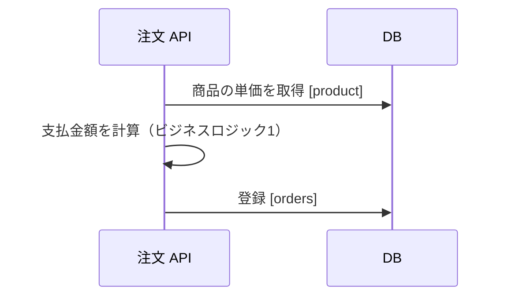

# 機能の設計書の構成

設計書は画面、Web API、非同期処理、I/F の単位で作り、正本にある識別子をタイトルに付ける。
処理の設計書は、処理概要、処理シーケンス、ビジネスロジック、DB 項目の順に書く。
画面の設計書には見た目を書かず、API の呼び出し、利用者の操作、画面間で受け渡す値、入力検証の業務ルールを書く。
正本にある情報は[設計書と正本の分担](design-doc-sources-of-truth.md)に従って書き写さない。

## 設計書の単位と識別子

設計書は次の単位で1文書ずつ作り、H1 を「識別子 機能名」にする（例：`# placeOrder 注文の受付`）。

- **画面**：route のパス（[フロントエンドのルーティングと状態管理](../frontend/routing-and-state.md)）。
- **Web API**：OpenAPI の `operationId`（[Orval と API 境界](../frontend/api-client-orval.md)）。
- **非同期処理**：イベント型名（[非同期処理の設計文書](../integration/async-design-documents.md)）。
- **I/F**：I/F 一覧の機能 ID（[連携の一覧と定義書](../integration/interface-documentation.md)）。

## 画面の設計書

画面遷移、レイアウト、表示項目の見た目は書かず、デザインツールのファイルへリンクする。
次の事項を書く。

- 初期表示で loader から取得する API の `operationId`。
- 利用者の操作ごとに、呼び出す API と画面の変化。
- 画面間で受け渡す path parameter と search parameter。
- 入力検証のうち、OpenAPI スキーマで表せない業務ルール（[API の入力検証の配置](../web-api/validation.md)）。

## 処理の設計書

Web API、非同期処理のプロデューサーとコンシューマー、I/F の受信と配信の処理は、次の4節をこの順に置く。

- **処理概要**：処理が必要な理由と、起動契機と処理の概略を箇条書きで書く。
- **処理シーケンス**：処理の流れを Mermaid のシーケンス図で書く。書き方は[設計書の図](design-doc-diagrams.md)に従う。
- **ビジネスロジック**：計算式と条件分岐を擬似コードで書き、`ビジネスロジック1` のように番号を付ける。シーケンス図と DB 項目からはこの番号で参照する。
- **DB 項目**：参照、登録、更新、削除ごとに、対象を `テーブル.カラム` の形で並べる。

DB 項目は次のように書く。

- 参照には抽出条件を書く。
- 登録と更新には、設定する値か、その値を計算するビジネスロジックの番号を書く。
- 該当がない節や特記事項がない節は、節を省かず「なし」と書く。

## Web API の設計書

リクエストとレスポンスの項目定義は OpenAPI で分かるため書かない。
複数のテーブルから応答を組み立てる場合に限り、「応答項目の由来」の節を置き、項目ごとに次の列を持つ表を書く。

- **項目**：OpenAPI のプロパティ名。
- **説明**：項目の意味。OpenAPI の `description` に書いてあれば空にする。
- **取得元**：値を取るテーブル。
- **備考**：加工して作る項目の計算方法、またはビジネスロジックの番号。

## I/F の設計書

連携方式、頻度、ファイルの形式、項目定義は[連携の一覧と定義書](../integration/interface-documentation.md)に従って書く。
受信と配信の処理は、処理の設計書の4節で書く。
最後に「エラー処理」の節を置き、エラーのパターンごとに、内容と回復方法を書く。

## Web API の設計書の例

````markdown
# placeOrder 注文の受付

## 処理概要

- 会員が選んだ商品の注文を受け付け、支払金額を確定する。
- 注文画面の確定操作で呼ばれ、支払金額を計算して注文を登録する。

## 処理シーケンス



## ビジネスロジック

### ビジネスロジック1

```text
支払金額 = 単価 * 数量
IF 会員区分 = 03
  支払金額 = 支払金額 * 0.95
END
```

## DB 項目

### 参照

- product.unit_price

抽出条件：

- product.product_id = リクエストの商品 ID

### 登録

- orders.product_id = リクエストの商品 ID
- orders.payment_amount = ビジネスロジック1

### 更新

なし

### 削除

なし

## 応答項目の由来

| 項目          | 説明 | 取得元  | 備考             |
| ------------- | ---- | ------- | ---------------- |
| orderId       |      | orders  |                  |
| paymentAmount |      | orders  | ビジネスロジック1 |
````

## 出典

- フューチャー株式会社「Markdown設計ドキュメント規約」（[アーキテクチャ設計ガイドライン](https://future-architect.github.io/arch-guidelines/documents/forMarkdown/markdown_design_document.html)、commit `e309a6d`）、[CC BY 4.0](https://creativecommons.org/licenses/by/4.0/deed.ja)
- このリポジトリの規約に合わせて抜粋、再構成、改変している。取り込みの方針は [ADR-040](../adr/ADR-040-import-future-architecture-guidelines.md) に従う。
